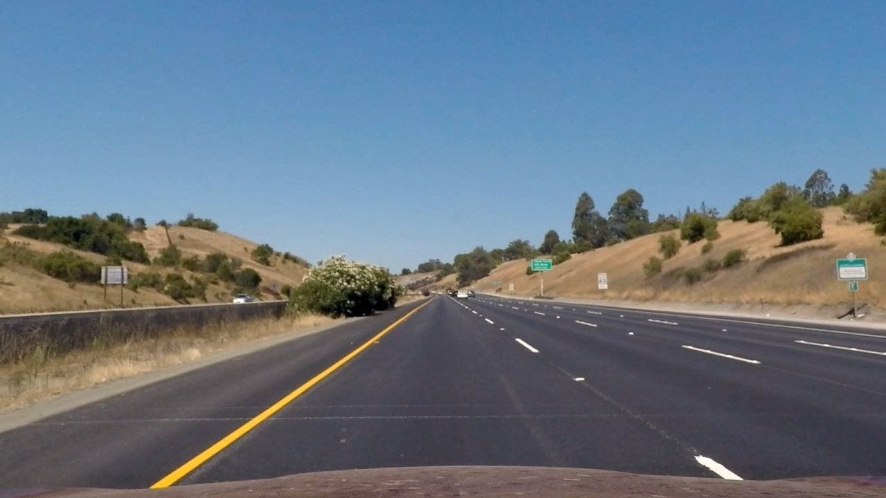
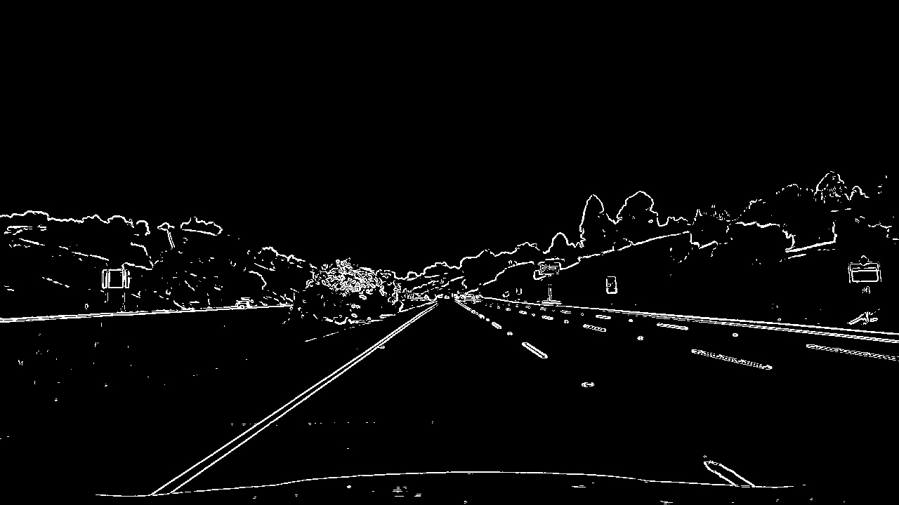
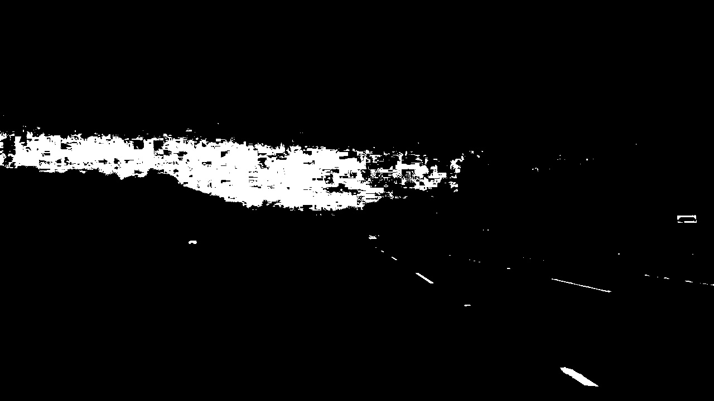
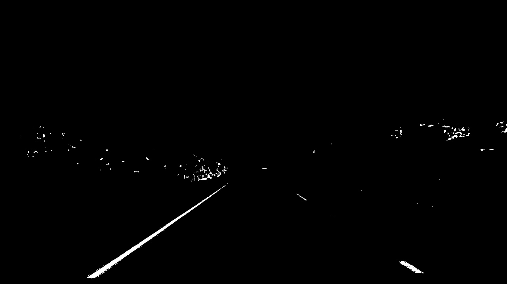
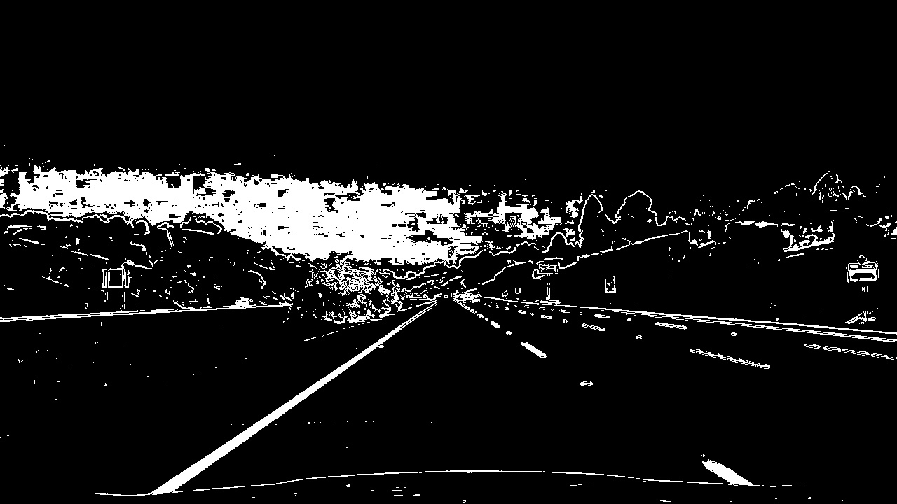
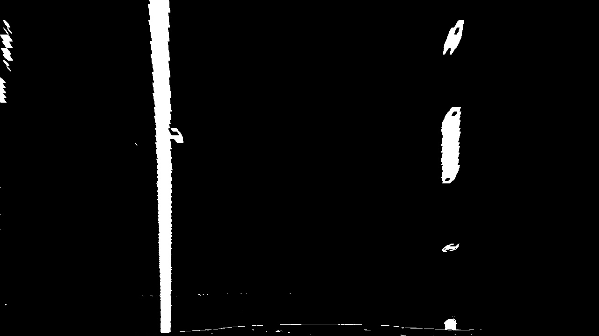
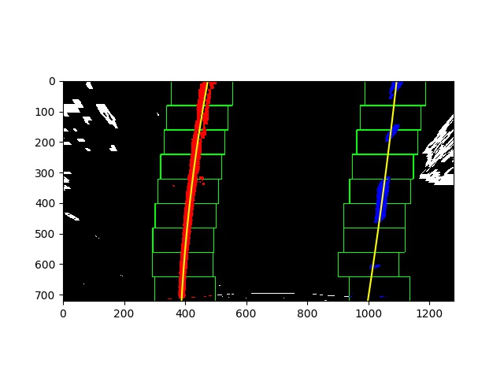
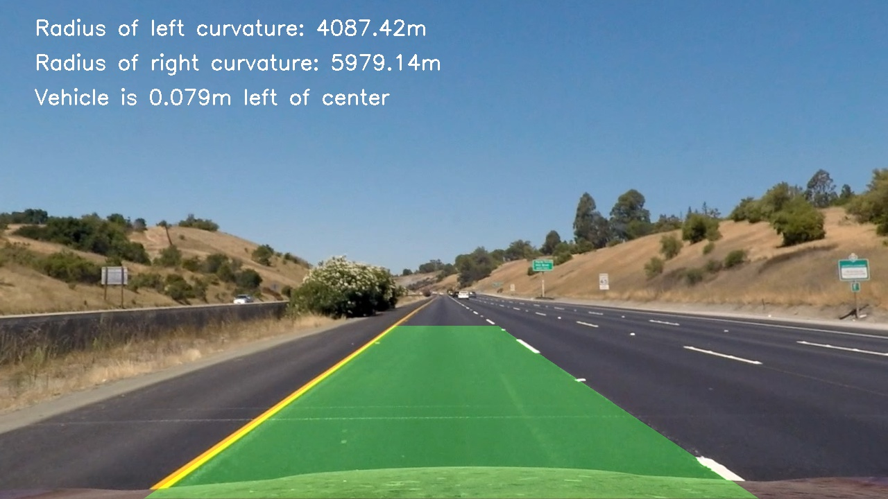

## Writeup Template

### You can use this file as a template for your writeup if you want to submit it as a markdown file, but feel free to use some other method and submit a pdf if you prefer.

---

**Advanced Lane Finding Project**

The goals / steps of this project are the following:

* Compute the camera calibration matrix and distortion coefficients given a set of chessboard images.
* Apply a distortion correction to raw images.
* Use color transforms, gradients, etc., to create a thresholded binary image.
* Apply a perspective transform to rectify binary image ("birds-eye view").
* Detect lane pixels and fit to find the lane boundary.
* Determine the curvature of the lane and vehicle position with respect to center.
* Warp the detected lane boundaries back onto the original image.
* Output visual display of the lane boundaries and numerical estimation of lane curvature and vehicle position.

[//]: # (Image References)

[image1]: ./output_images/original.jpg "Original Image"
[image2]: ./output_images/undistorted.jpg "Undistorted"
[image3]: ./output_images/preprocessed-image.jpg "Binary Example"
[image4]: ./output_images/warped.jpg "Warp Example"
[image5]: ./output_images/plot.jpg "Fit Visual"
[image6]: ./output_images/fitted-detail.jpg "Output"
[video1]: ./output1_tracked.mp4 "Video"

## [Rubric](https://review.udacity.com/#!/rubrics/571/view) Points

### Here I will consider the rubric points individually and describe how I addressed each point in my implementation.  

---

### Writeup / README

#### 1. Provide a Writeup / README that includes all the rubric points and how you addressed each one.  You can submit your writeup as markdown or pdf.  [Here](https://github.com/udacity/CarND-Advanced-Lane-Lines/blob/master/writeup_template.md) is a template writeup for this project you can use as a guide and a starting point.  

You're reading it!

### Camera Calibration

#### 1. Briefly state how you computed the camera matrix and distortion coefficients. Provide an example of a distortion corrected calibration image.

The code for this step is in calibrate.py.

I used several images of a checkerboard that were taken with the same camera that was used in our provided video and sample images.

Calibration invovles taking several points in an image and pairing them with points where you expect those objects to be. `cv2` provides several functions that simplify this process. `cv2.findChessboardCorners` takes an image of a chessboard and returns the pixel locations of grid corners.

Here's an example of those pixels drawn on a calibration image:


Those pixels are then paired with the real corner locations (`objpoints`). After looping through each calibration image, their pixel pairs are fed into `cv2.calibrateCamera` which returns the camera matrix (`mtx`) and distortion coefficients (`dist`).

As a test, I used `mtx` and `dist` to undistort a calibration image to make sure that everything was setup properly:


Then, I saved `mtx` and `dist` to a pickle file (`calibration_pickle.p`) so they could be used to undistort images later in the pipeline.

### Pipeline (single images)

#### 1. Provide an example of a distortion-corrected image.

To demonstrate this step, I will describe how I apply the distortion correction to one of the test images like this one:


The matrix (`mtx`) and distortion (`dist`) coefficients are loaded from the pickle file created in the calibration step. Then, the image is undistorted using `cv2.undistort`.

```
cv2.undistort(self.image, self.mtx, self.dist, None, self.mtx)
```



#### 2. Describe how (and identify where in your code) you used color transforms, gradients or other methods to create a thresholded binary image.  Provide an example of a binary image result.

I used a combination of color and gradient thresholds to generate a binary image (thresholding steps at lines #70 through #180 in `pipeline.py`).

First, I created a binary image by finding the gradient in the x and y directions. Then, this was combined with magnitude and direction binary images:


Next, I created a color binary image by combining a binary image from the R color channel and by converting the image to HLS space and creating a binary from the S channel:




The color and gradient binary images were then combined:


#### 3. Describe how (and identify where in your code) you performed a perspective transform and provide an example of a transformed image.

The code for my perspective transform is on lines 37-48 in pipeline.py.
I chose to hardcode the source and destination points in the following manner:

```python
src = np.float32([[(200, 720), (570, 470), (720, 470), (1130, 720)]])
dst = np.float32([[(350, 720), (350, 0), (980, 0), (980, 720)]])
```

This resulted in the following source and destination points:

| Source        | Destination   |
|:-------------:|:-------------:|
| 200, 720      | 350, 720      |
| 570, 470      | 350, 0        |
| 720, 470      | 980, 0        |
| 1130, 720     | 980, 720      |

I verified that my perspective transform was working as expected by drawing the `src` and `dst` by previewing the topdown warped image to make sure the lanes were roughly parallel:



#### 4. Describe how (and identify where in your code) you identified lane-line pixels and fit their positions with a polynomial?

This can be found in the code in window.py (fit_polynomial, sliding_window, and start_from_previous_frame functions) and in pipeline.py (run function, lines 207-209).

First, I took a histogram of the bottom half of the image.

```
histogram = np.sum(self.image[self.image.shape[0]//2:,:], axis=0)
```

Then, I found the peaks for the left and right portions:

```
midpoint = np.int(histogram.shape[0]/2)
leftx_base = np.argmax(histogram[:midpoint])
rightx_base = np.argmax(histogram[midpoint:]) + midpoint
```

`leftx_base` and `rightx_base` were used as a starting point for sliding windows. The image is divided into 9 sections vertically. Starting at the bottom of the image, we look for non zero pixels within 100 pixels from our base points and save their indices for reference.

If at least 50 non zero pixels were found, we take the mean of those pixel locations as the starting point for the next window:

```
if len(good_left_inds) > self.minpix:
    leftx_current = np.int(np.mean(self.nonzerox[good_left_inds]))
if len(good_right_inds) > self.minpix:
    rightx_current = np.int(np.mean(self.nonzerox[good_right_inds]))
```

Once we've found lane pixels in each of the 9 windows, their pixel locations are extracted and used to fit a second order polynomial:

```
self.leftx = self.nonzerox[left_lane_inds]
self.lefty = self.nonzeroy[left_lane_inds]
self.rightx = self.nonzerox[right_lane_inds]
self.righty = self.nonzeroy[right_lane_inds]

# Fit a second order polynomial to each
self.left_fit = np.polyfit(self.lefty, self.leftx, 2)
self.right_fit = np.polyfit(self.righty, self.rightx, 2)
```

Then, x and y values are generated for plotting our lanes:

```
self.ploty = np.linspace(0, self.image.shape[0]-1, self.image.shape[0] )
self.left_fitx = self.left_fit[0]*self.ploty**2 + self.left_fit[1]*self.ploty + self.left_fit[2]
self.right_fitx = self.right_fit[0]*self.ploty**2 + self.right_fit[1]*self.ploty + self.right_fit[2]
```

Here's an example of the sliding window:


For images in a video series, the `left_fitx` and `right_fitx` are stored in a `Line` instance for the left and right lane. `Line.find_best_fit` is used to smooth the line over the last 15 frames.

The current frame is diffed with the last frame by finding the mean squared
error:

```
self.mean_distance = ((self.current_fitx - last_fit) ** 2).mean(axis=0)
```

If the difference was less than 500, the current_fitx was appended to a list of fitted lines. The best fit was then calculated by taking the average of the last 15 frames:

```
self.bestx = np.average(self.allx[-self.smooth_factor:], axis=0)
```

This `bestx` was used when drawing the left and right lanes.

Also, if the diff is less than 500, the current_fit is stored for the lane. On the next frame of the video, we're able to skip the sliding window and instead just search in a margin around the previously detected fit (Window.start_from_previous_frame):

```
left_lane_inds = ((self.nonzerox > (self.left_fit[0]*(self.nonzeroy**2) + self.left_fit[1]*self.nonzeroy +
    self.left_fit[2] - self.margin)) & (self.nonzerox < (self.left_fit[0]*(self.nonzeroy**2) +
    self.left_fit[1]*self.nonzeroy + self.left_fit[2] + self.margin)))

right_lane_inds = ((self.nonzerox > (self.right_fit[0]*(self.nonzeroy**2) + self.right_fit[1]*self.nonzeroy +
    self.right_fit[2] - self.margin)) & (self.nonzerox < (self.right_fit[0]*(self.nonzeroy**2) +
    self.right_fit[1]*self.nonzeroy + self.right_fit[2] + self.margin)))
```

#### 5. Describe how (and identify where in your code) you calculated the radius of curvature of the lane and the position of the vehicle with respect to center.

###### Radius of curvature
I calculated radius of curvature for the left and right lanes in window.py (Window.curvature).
First, we take the y position from the bottom of the image that is closest to the camera:

```
y_eval = np.max(self.ploty)
```

The left and right pixel values are mapped to world space by scaling them by the number of expected meters for our lane (`xm_per_pix` and `ym_per_pix`). They are then fit to another polynomial:

```
self.left_fit_cr = np.polyfit(self.lefty*self.ym_per_pix, self.leftx*self.xm_per_pix, 2)
self.right_fit_cr = np.polyfit(self.righty*self.ym_per_pix, self.rightx*self.xm_per_pix, 2)
```

Those polynomials along with `y_eval` are used to calculate the radius of curvature for the left and right lanes:

```
left_curverad = ((1 + (2*self.left_fit_cr[0]*y_eval*self.ym_per_pix + self.left_fit_cr[1])**2)**1.5) / np.absolute(2*self.left_fit_cr[0])
right_curverad = ((1 + (2*self.right_fit_cr[0]*y_eval*self.ym_per_pix + self.right_fit_cr[1])**2)**1.5) / np.absolute(2*self.right_fit_cr[0])
```

###### Center offset
The center offset is also calculated in window.py (Window.center_offset) by
finding the center point between the left and right lane at the bottom of the
image and taking the difference of that center point with the center of the
image itself. This number is then scaled by `xm_per_pix`.

```
camera_center = (self.left_fitx[-1] + self.right_fitx[-1])/2
return (camera_center-self.image.shape[1]/2)*self.xm_per_pix
```

#### 6. Provide an example image of your result plotted back down onto the road such that the lane area is identified clearly.

I implemented this step in lines 50 through 68 in my code in `pipeline.py` in the function `draw()`. Here is an example of my result on a test image:



---

### Pipeline (video)

#### 1. Provide a link to your final video output.  Your pipeline should perform reasonably well on the entire project video (wobbly lines are ok but no catastrophic failures that would cause the car to drive off the road!).

Here's a [link to my video result](./output1_tracked.mp4)

---

### Discussion

#### 1. Briefly discuss any problems / issues you faced in your implementation of this project.  Where will your pipeline likely fail?  What could you do to make it more robust?

In my first implementation, I had a lot of issues with shaddows and when a black car passes on the right, it seemed to pick up the lanes in the cars reflection.  Theses problems caused the lane area to jitter and at times move far into the right lane.

In order to fix it, I started to keep track of the previous lines. After fitting a polynomial for a new frame, I diffed it with the previous line by finding the mean squared error. I monitored common mean squared errors and found that it was usually lower than 500, so I picked that number as a threshold.  Whenever the difference went over 500, I would reject the new line and use an average of the last 15 frames.

This pipeline does not perform well when there are strong shadows. Also, simply diffing the current fit with the last fit is not a robust way to determine if the current fit is good. I could also monitor the radius of curvature to see if the new radius is similar to the last.
